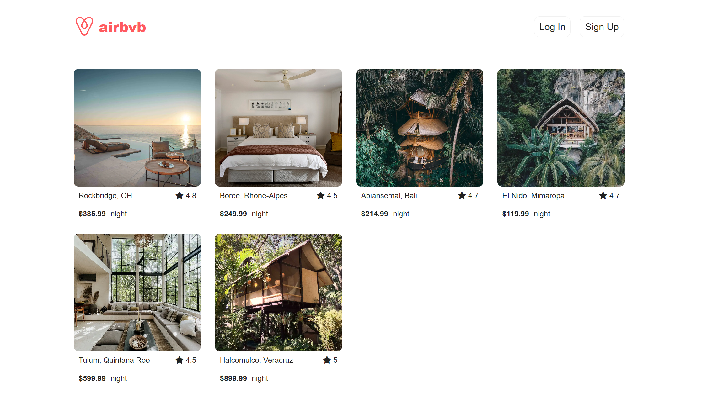
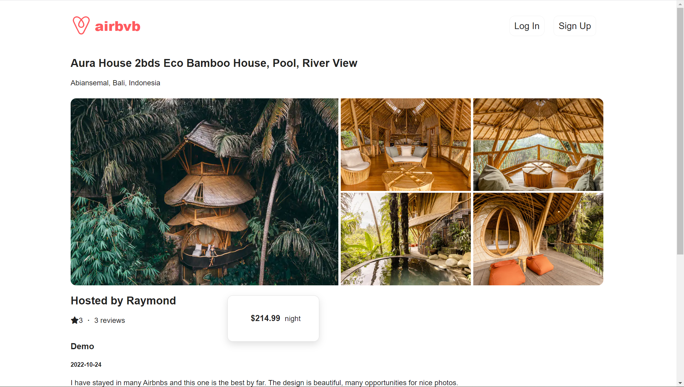
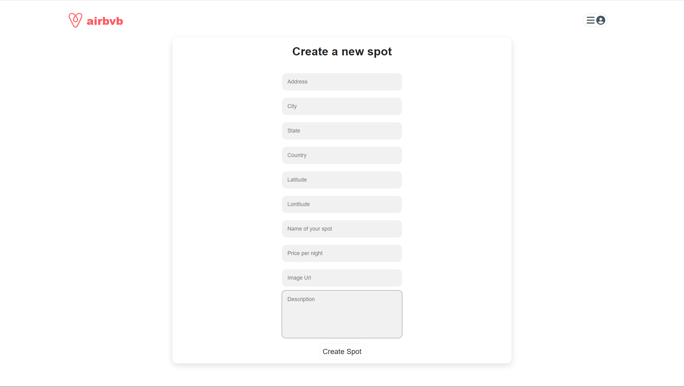
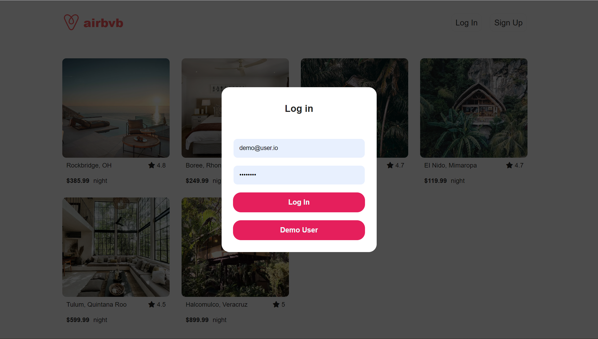

# Airbvb

Airbvb is a website clone, inspired by Airbnb. Airbvb could be used for making your journey more convenient which community members could book rooms in their trip destinations and share amazing trip experience with others.

[Click here to view Airbvb Live Site](https://airbvb.herokuapp.com/)

### Wiki Link
* [Database Schema](https://github.com/iffy713/Airbvb/wiki/Database-Schema)
* [Feature List](https://github.com/iffy713/Airbvb/wiki/Feature-List)

### This project is built with:
* Javascript
* PostgreSQL
* Sequelize
* React
* Redux
* Express

## Feature Directions:
### Home Page Demo User:

### Spot Details Page:

### Create New Spot Page:

### User Log In Page:

